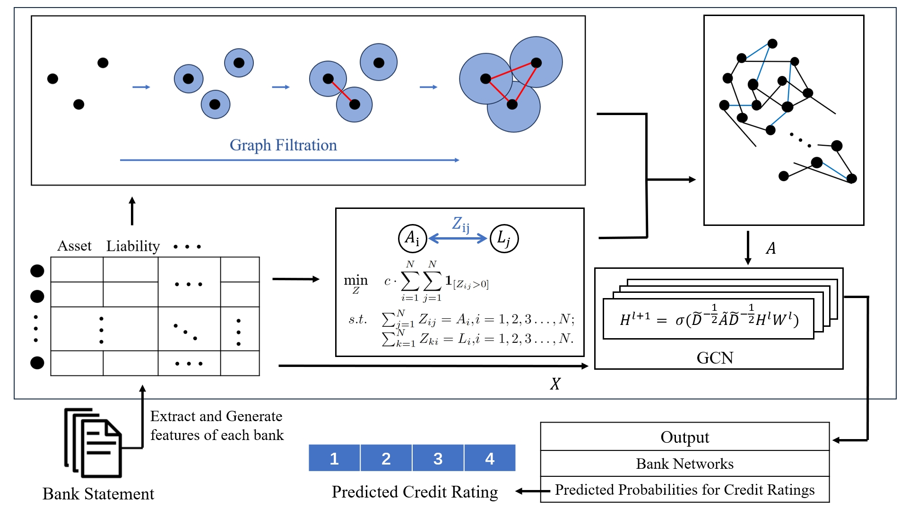

# HTGNN
Implementation for the paper "Prediction of Bank Credit Ratings using Heterogeneous Topological Graph Neural Networks" (WITS 2024)

## Abstract

This paper introduces our Heterogeneous Topological Graph Neural Network (HTGNN) model to improve the precision of bank credit rating predictions. Agencies such as Standard & Poor's and Moody's provide bank credit ratings that influence economic stability and decision-making by stakeholders. Accurate and timely predictions support informed decision-making, regulatory actions, and investor protection. However, a complete interbank connection graph is often unavailable due to privacy concerns, complicating the direct application of Graph Neural Networks (GNNs) for rating prediction. our research utilizes persistent homology to construct a network that captures relationships among banks and combines this with a traditional lending network to create a heterogeneous network that integrates information from both sources, leading to improved predictions. Experiments on a global, real-world dataset validate the effectiveness of HTGNN. This research has implications for investors and regulatory bodies in enhancing proactive risk mitigation and the implementation of effective market interventions.



## Usage

### Training & Testing
To train the model, run
```
python main.py --year predict_year --Q predict_quarter
```

% ### Data

% Dataset can find at https://github.com/AI4Risk/interbank/tree/main/datasets

## Citing this work
